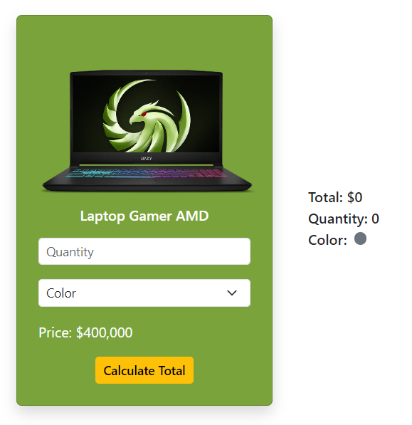

# Challenge 1 - Calculating the total

The objective is to implement a product card displayed in an online store and add user interaction by allowing modification of the product quantity and color.

**Description**

You should use the tools we learned to manipulate DOM elements, such as the `querySelector` method and the modification of styles through each element's `style` object.

Below is what you need to layout:

The user should be able to type the product quantity and color through the inputs, and then by pressing the Calculate Total button, the total amount to be paid for the product, the quantity, and the specified color should be displayed on the right.

## Requirements

1. Add all the necessary elements within the HTML.
2. Add the event to the correct element using the requested event type.
3. Select and save the elements to be modified in variables.
4. Modify the DOM to update the total amount to be paid.
5. Modify the DOM to update the specified product quantity in the input.
6. Modify the DOM to change the color of the circle using the color specified by the user.

🧑‍💻 Good luck!