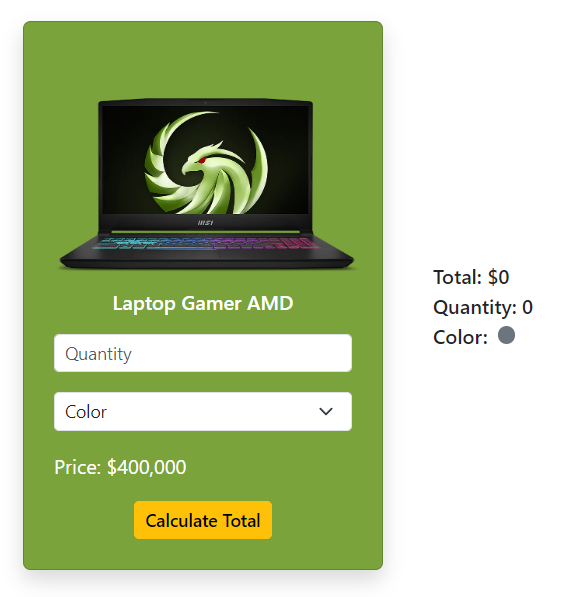
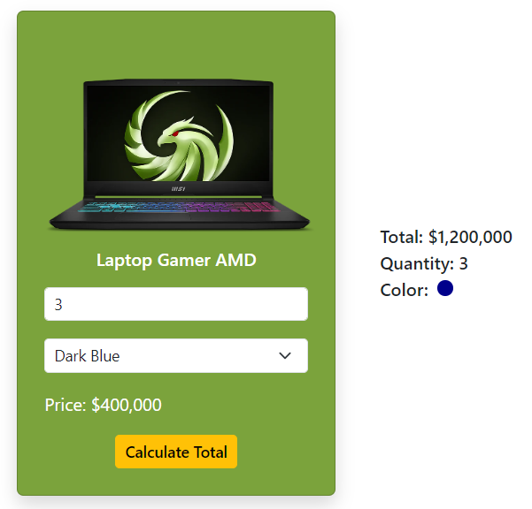

<div align="center">

# Challenge 1 - DOM Manipulation and Conditionals

</div>

The objective is to implement a product card displayed in an online store and add user interaction by allowing modification of the product quantity and color.

**Description**

You should use the tools you've learned to manipulate DOM elements, such as the `querySelector` method and modifying styles through the `style` object of each element.

Below is what you need to layout:

<div align="center">



</div>

The user should be able to type the product quantity and color through the inputs, and then by pressing the *Calculate Total* button, the total amount to be paid for the product, the quantity, and the specified color should be displayed on the right.

<div align="center">



</div>

## Requirements

1. Add all the necessary elements inside the HTML and use Bootstrap to apply styles.
2. Add the event to the correct element using the requested event type.
3. Select and save the elements to be modified in variables.
4. Modify the DOM to update the total amount to be paid.
5. Modify the DOM to update the product quantity specified in the input.
6. Modify the DOM to change the color of the circle using the color specified by the user.

**Validations**:
   1. Only a number greater than 0 and less than 10 can be entered   in the *quantity* input.
   2. The total amount can only be calculated if there is a quantity entered and the product color.
   3. If the product color is not selected or the quantity field is empty, an alert must be displayed to the user indicating that neither of the two fields must be empty.


Good luck!

## Running the Challenge with Vite.js

This challenge has been completed using Vite.js. Follow the steps below to set up and run the project:

### Prerequisites

Make sure you have Node.js installed on your machine. You can download it from [here](https://nodejs.org/).

### Installation

1. **Clone the Repository**
   ```bash
   git clone https://github.com/your-username/your-repo-name.git
   cd your-repo-name
   ```

2. **Install Dependencies**
   ```bash
   npm install
   ```

### Running the Project

1. **Start the Development Server**
   ```bash
   npm run dev
   ```

2. Open your browser and navigate to the URL provided by Vite (usually `http://localhost:5173`).

### Building for Production

To build the project for production, run:
```bash
npm run build
```

This will create a `dist` folder with the production build of your project.

### Previewing the Production Build

To preview the production build locally, run:
```bash
npm run serve
```

This will serve the production build on a local server.

## Project Structure

- `index.html`: The main HTML file.
- `src/`: The source folder containing JavaScript, CSS, and other assets.
- `vite.config.js`: The configuration file for Vite.js.

### Modifying the Project

- **HTML**: Add all necessary elements within the `index.html`.
- **JavaScript**: Implement the interaction logic in `src/main.js`.
- **CSS**: Style the product card in `src/style.css`.

### Additional Notes

Feel free to customize and extend the project as needed. If you encounter any issues, refer to the [Vite.js documentation](https://vitejs.dev/) or seek help from the community.

Happy coding!