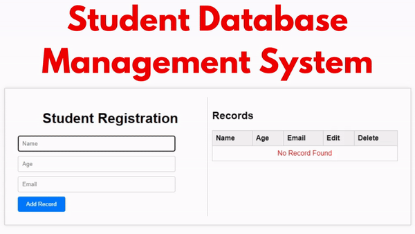

<div align="center">

# Challenge 2 - CRUD and data persistence

</div>

The objective is to implement a student registry where the student is asked for their first name, last name, age and email and record the data in the browser's local storage as a database.

**Description**

You should use the tools you've learned to manipulate DOM elements, functions, and investigate how to persist data in the browser.

You must create a structure with 2 columns, in the left column a form with the user input and in the right column the table with the student record.

Example of what to layout:

<div align="center">



</div>

User should be able to add new record, edit and view and delete.

## Requirements

1. Add all the necessary elements within the HTML and use Bootstrap to apply styles.
2. Add the necessary bootstrap classes for the HTML view to adapt to any screen size.
3. Add the event to the right element using the type of requested event.
4. Add the following functions (create, edit, show and delete)
record.
5. Persist the data in the storage of the browser.

**Validations**:

   1. Validate the first name and first surname.
   2. Validate the age field must be greater than or equal to 18.
   3. Validate the mail field.
   4. The Add New Registry button must be destabilized, if the fields are correct and the validations pass enable the button.

Good luck!

## Running the Challenge with Vite.js

This challenge has been completed using Vite.js. Follow the steps below to set up and run the project:

### Prerequisites

Make sure you have Node.js installed on your machine. You can download it from [here](https://nodejs.org/).

### Installation

1. **Clone the Repository**
   ```bash
   git clone https://github.com/your-username/your-repo-name.git
   cd your-repo-name
   ```

2. **Install Dependencies**
   ```bash
   npm install
   ```

### Running the Project

1. **Start the Development Server**
   ```bash
   npm run dev
   ```

2. Open your browser and navigate to the URL provided by Vite (usually `http://localhost:5173`).

### Building for Production

To build the project for production, run:
```bash
npm run build
```

This will create a `dist` folder with the production build of your project.

### Previewing the Production Build

To preview the production build locally, run:
```bash
npm run serve
```

This will serve the production build on a local server.

## Project Structure

- `index.html`: The main HTML file.
- `src/`: The source folder containing JavaScript, CSS, and other assets.
- `vite.config.js`: The configuration file for Vite.js.

### Modifying the Project

- **HTML**: Add all necessary elements within the `index.html`.
- **JavaScript**: Implement the interaction logic in `src/main.js`.
- **CSS**: Style the product card in `src/style.css`.

### Additional Notes

Feel free to customize and extend the project as needed. If you encounter any issues, refer to the [Vite.js documentation](https://vitejs.dev/) or seek help from the community.

Happy coding!