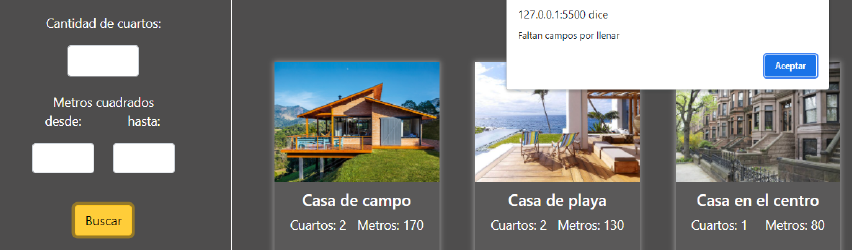

<div align="center">

# Challenge 3 - Array and objects

</div>

The objective of this challenge is to create a small website for a real estate agency, a form must be added to filter and search for the type of property that the client is looking for.

**Description**

Program the dynamic rendering of real estate properties and search filters
of a side menu.

Reference of what should be laid out using **Bootstrap** styles in a responsive design:

<div align="center">


</div>

Filter to search for real estate properties:

<div align="center">


</div>

Property gallery with total search:

<div align="center">


</div>

The user must be able to type in the filter the number of rooms and a range of square meters that he/she wishes to define for the search for properties that meet these criteria.

If any field is missing, the user should be notified with a pop-up window:

<div align="center">



</div>

Upon successful completion of a search, the new property total value should be updated:

<div align="center">


</div>

## Requirements

1. Implement all the elements necessary to apply the functionality of the
challenge.
2. Create an array of properties that meet the following structure:
```json
{
    name: "Department",
    description: "From above everything looks better",
    src: "...",
    rooms: 3,
    meters: 200,
},
```
3. Add the click event to the search button.
4. Group logic into reusable functions that are executed on every search.
5. Use loops to iterate through the properties array.
6. Uses *interpolation* and *innerHTML* to create templates and add property templates during array traversal.
7. Use conditionals to evaluate if any fields are missing in the search engine.
8. Correctly validate each input in the filter form before performing the search.
9. Updates the total results for each successfully generated search.

**Validations**:
    1. Validates that no field is empty.
    2. The minimum number of rooms is 1 to 4 or more, it is valid that only whole numbers and not negative numbers are entered.
    3. The minimum and maximum number of square meters can be any integer or decimal, it cannot be a negative number.

Good luck!

## Running the Challenge with Vite.js

This challenge has been completed using Vite.js. Follow the steps below to set up and run the project:

### Prerequisites

Make sure you have Node.js installed on your machine. You can download it from [here](https://nodejs.org/).

### Installation

1. **Clone the Repository**
   ```bash
   git clone https://github.com/your-username/your-repo-name.git
   cd your-repo-name
   ```

2. **Install Dependencies**
   ```bash
   npm install
   ```

### Running the Project

1. **Start the Development Server**
   ```bash
   npm run dev
   ```

2. Open your browser and navigate to the URL provided by Vite (usually `http://localhost:5173`).

### Building for Production

To build the project for production, run:
```bash
npm run build
```

This will create a `dist` folder with the production build of your project.

### Previewing the Production Build

To preview the production build locally, run:
```bash
npm run serve
```

This will serve the production build on a local server.

## Project Structure

- `index.html`: The main HTML file.
- `src/`: The source folder containing JavaScript, CSS, and other assets.
- `vite.config.js`: The configuration file for Vite.js.

### Modifying the Project

- **HTML**: Add all necessary elements within the `index.html`.
- **JavaScript**: Implement the interaction logic in `src/main.js`.
- **CSS**: Style the product card in `src/style.css`.

### Additional Notes

Feel free to customize and extend the project as needed. If you encounter any issues, refer to the [Vite.js documentation](https://vitejs.dev/) or seek help from the community.

Happy coding!